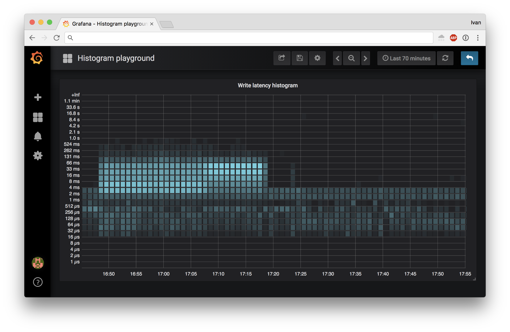

# ebpf_exporter

Prometheus exporter for custom eBPF metrics.

Motivation of this exporter is to allow you to write eBPF code and export
metrics that are not otherwise accessible from the Linux kernel.

eBPF was [described by](https://lkml.org/lkml/2015/4/14/232) Ingo Molnár as:

> One of the more interesting features in this cycle is the ability to attach
> eBPF programs (user-defined, sandboxed bytecode executed by the kernel)
> to kprobes. This allows user-defined instrumentation on a live kernel image
> that can never crash, hang or interfere with the kernel negatively.

An easy way of thinking about this exporter is bcc tools as prometheus metrics:

* https://iovisor.github.io/bcc

We use libbpf rather than legacy bcc driven code, so it's more like libbpf-tools:

* https://github.com/iovisor/bcc/tree/master/libbpf-tools

## Reading material

* https://www.brendangregg.com/ebpf.html
* https://nakryiko.com/posts/bpf-core-reference-guide/
* https://nakryiko.com/posts/bpf-portability-and-co-re/
* https://nakryiko.com/posts/bcc-to-libbpf-howto-guide/
* https://libbpf.readthedocs.io/en/latest/program_types.html

## Building and running

### Note on libbpf

`ebpf_exporter` depends on `libbpf` to load eBPF code into the kernel,
and you need to have it installed on your system. Alternatively, you
can use the bundled `Dockerfile` to have `libbpf` compiled in there.

* https://github.com/iovisor/bcc/blob/master/INSTALL.md

Note that there's a dependency between `libbpf` version you have installed
and `libbpfgo`, which is Go's library to talk to `libbpf`

Currently we target `libbpf` v1.2, which has a stable interface.

We compile `ebpf_exporter` with `libbpf` statically compiled in,
so there's only ever a chance of build time issues, never at run time.

### Actual building

To build a binary, clone the repo and run:

```
make build
```

If you're having trouble building on the host, you can try building in Docker:

```
docker build -t ebpf_exporter .
docker cp $(docker create ebpf_exporter):/ebpf_exporter ./
```

To build examples (see [building examples section](#building-examples)):

```
make -C examples clean build
```

To run with [`biolatency`](examples/biolatency.yaml) config:

```
sudo ./ebpf_exporter --config.dir examples --config.names biolatency
```

If you pass `--debug`, you can see raw maps at `/maps` endpoint.

### Docker image

A docker image can be built from this repo. It is not yet published.

To build the image, run the following:

```
docker build --tag ebpf_exporter .
```

To run it with the examples, you need to build them first (see above).
Then you can run by running a privileged container and bind-mounting:

* `$(pwd)/examples:/examples:ro` to allow access to examples
* `/sys/kernel/debug:/sys/kernel/debug:ro` to allow finding tracepoints
* `/sys/fs/cgroup:/sys/fs/cgroup:ro` to allow resolving cgroups

You might have to bind-mount additional directories depending on your needs.
You might also not need to bind-mount anything for simple kprobe examples.

The actual command to run the docker container (from the repo directory):

```
docker run --rm -it --privileged -p 9435:9435 \
  -v $(pwd)/examples:/examples \
  -v /sys/kernel/debug:/sys/kernel/debug:ro \
  -v /sys/fs/cgroup:/sys/fs/cgroup:ro \
  ebpf_exporter --config.dir examples --config.names timers
```

For production use you would either bind-mount your own config and compiled
bpf programs corresponding to it, or build your own image based on ours
with your own config baked in.

## Benchmarking overhead

See [benchmark](benchmark) directory to get an idea of how low ebpf overhead is.

## Supported scenarios

Currently the only supported way of getting data out of the kernel is via maps.

See [examples](#examples) section for real world examples.

If you have examples you want to share, please feel free to open a PR.

## Configuration

Skip to [format](#configuration-file-format) to see the full specification.

### Examples

You can find additional examples in [examples](examples) directory.

Unless otherwise specified, all examples are expected to work on Linux 5.15,
which is the latest LTS release at the time of writing. Thanks to CO-RE,
examples are also supposed to work on any modern kernel with BTF enabled.

You can find the list of supported distros in `libbpf` README:

* https://github.com/libbpf/libbpf#bpf-co-re-compile-once--run-everywhere

#### Building examples

To build examples, run:

```
make -C examples clean build
```

This will use `clang` to build examples with `vmlinux.h` we provide
in this repo (see [include](include/README.md) for more on `vmlinux.h`).

Examples need to be compiled before they can be used.

Note that compiled examples can be used as is on any BTF enabled kernel
with no runtime dependencies. Most modern Linux distributions have it enabled.

#### Timers via tracepoints (counters)

This config attaches to kernel tracepoints for timers subsystem
and counts timers that fire with breakdown by timer name.

Resulting metrics:

```
# HELP ebpf_exporter_timer_starts_total Timers fired in the kernel
# TYPE ebpf_exporter_timer_starts_total counter
ebpf_exporter_timer_starts_total{function="blk_stat_timer_fn"} 10
ebpf_exporter_timer_starts_total{function="commit_timeout	[jbd2]"} 1
ebpf_exporter_timer_starts_total{function="delayed_work_timer_fn"} 25
ebpf_exporter_timer_starts_total{function="dev_watchdog"} 1
ebpf_exporter_timer_starts_total{function="mix_interrupt_randomness"} 3
ebpf_exporter_timer_starts_total{function="neigh_timer_handler"} 1
ebpf_exporter_timer_starts_total{function="process_timeout"} 49
ebpf_exporter_timer_starts_total{function="reqsk_timer_handler"} 2
ebpf_exporter_timer_starts_total{function="tcp_delack_timer"} 5
ebpf_exporter_timer_starts_total{function="tcp_keepalive_timer"} 6
ebpf_exporter_timer_starts_total{function="tcp_orphan_update"} 16
ebpf_exporter_timer_starts_total{function="tcp_write_timer"} 12
ebpf_exporter_timer_starts_total{function="tw_timer_handler"} 1
ebpf_exporter_timer_starts_total{function="writeout_period"} 5
```

There's config file for it:

```yaml
metrics:
  counters:
    - name: timer_starts_total
      help: Timers fired in the kernel
      labels:
        - name: function
          size: 8
          decoders:
            - name: ksym
```

And corresponding C code that compiles into an ELF file with eBPF bytecode:

```C
#include <vmlinux.h>
#include <bpf/bpf_helpers.h>
#include "maps.bpf.h"

struct {
    __uint(type, BPF_MAP_TYPE_HASH);
    __uint(max_entries, 1024);
    __type(key, u64);
    __type(value, u64);
} timer_starts_total SEC(".maps");

SEC("tracepoint/timer/timer_start")
int do_count(struct trace_event_raw_timer_start* ctx)
{
    u64 function = (u64) ctx->function;

    increment_map(&timer_starts_total, &function, 1);

    return 0;
}

char LICENSE[] SEC("license") = "GPL";
```

#### Block IO histograms (histograms)

This config attaches to block io subsystem and reports disk latency
as a prometheus histogram, allowing you to compute percentiles.

The following tools are working with similar concepts:

* https://github.com/iovisor/bcc/blob/master/tools/biosnoop_example.txt
* https://github.com/iovisor/bcc/blob/master/tools/biolatency_example.txt
* https://github.com/iovisor/bcc/blob/master/tools/bitesize_example.txt

This program was the initial reason for the exporter and was heavily
influenced by the experimental exporter from Daniel Swarbrick:

* https://github.com/dswarbrick/ebpf_exporter

Resulting metrics:

```
# HELP ebpf_exporter_bio_latency_seconds Block IO latency histogram
# TYPE ebpf_exporter_bio_latency_seconds histogram
ebpf_exporter_bio_latency_seconds_bucket{device="nvme0n1",operation="write",le="1e-06"} 0
ebpf_exporter_bio_latency_seconds_bucket{device="nvme0n1",operation="write",le="2e-06"} 0
ebpf_exporter_bio_latency_seconds_bucket{device="nvme0n1",operation="write",le="4e-06"} 0
ebpf_exporter_bio_latency_seconds_bucket{device="nvme0n1",operation="write",le="8e-06"} 0
ebpf_exporter_bio_latency_seconds_bucket{device="nvme0n1",operation="write",le="1.6e-05"} 0
ebpf_exporter_bio_latency_seconds_bucket{device="nvme0n1",operation="write",le="3.2e-05"} 0
ebpf_exporter_bio_latency_seconds_bucket{device="nvme0n1",operation="write",le="6.4e-05"} 0
ebpf_exporter_bio_latency_seconds_bucket{device="nvme0n1",operation="write",le="0.000128"} 22
ebpf_exporter_bio_latency_seconds_bucket{device="nvme0n1",operation="write",le="0.000256"} 36
ebpf_exporter_bio_latency_seconds_bucket{device="nvme0n1",operation="write",le="0.000512"} 40
ebpf_exporter_bio_latency_seconds_bucket{device="nvme0n1",operation="write",le="0.001024"} 48
ebpf_exporter_bio_latency_seconds_bucket{device="nvme0n1",operation="write",le="0.002048"} 48
ebpf_exporter_bio_latency_seconds_bucket{device="nvme0n1",operation="write",le="0.004096"} 48
ebpf_exporter_bio_latency_seconds_bucket{device="nvme0n1",operation="write",le="0.008192"} 48
ebpf_exporter_bio_latency_seconds_bucket{device="nvme0n1",operation="write",le="0.016384"} 48
ebpf_exporter_bio_latency_seconds_bucket{device="nvme0n1",operation="write",le="0.032768"} 48
ebpf_exporter_bio_latency_seconds_bucket{device="nvme0n1",operation="write",le="0.065536"} 48
ebpf_exporter_bio_latency_seconds_bucket{device="nvme0n1",operation="write",le="0.131072"} 48
ebpf_exporter_bio_latency_seconds_bucket{device="nvme0n1",operation="write",le="0.262144"} 48
ebpf_exporter_bio_latency_seconds_bucket{device="nvme0n1",operation="write",le="0.524288"} 48
ebpf_exporter_bio_latency_seconds_bucket{device="nvme0n1",operation="write",le="1.048576"} 48
ebpf_exporter_bio_latency_seconds_bucket{device="nvme0n1",operation="write",le="2.097152"} 48
ebpf_exporter_bio_latency_seconds_bucket{device="nvme0n1",operation="write",le="4.194304"} 48
ebpf_exporter_bio_latency_seconds_bucket{device="nvme0n1",operation="write",le="8.388608"} 48
ebpf_exporter_bio_latency_seconds_bucket{device="nvme0n1",operation="write",le="16.777216"} 48
ebpf_exporter_bio_latency_seconds_bucket{device="nvme0n1",operation="write",le="33.554432"} 48
ebpf_exporter_bio_latency_seconds_bucket{device="nvme0n1",operation="write",le="67.108864"} 48
ebpf_exporter_bio_latency_seconds_bucket{device="nvme0n1",operation="write",le="134.217728"} 48
ebpf_exporter_bio_latency_seconds_bucket{device="nvme0n1",operation="write",le="+Inf"} 48
ebpf_exporter_bio_latency_seconds_sum{device="nvme0n1",operation="write"} 0.021772
ebpf_exporter_bio_latency_seconds_count{device="nvme0n1",operation="write"} 48
ebpf_exporter_bio_latency_seconds_bucket{device="nvme1n1",operation="write",le="1e-06"} 0
ebpf_exporter_bio_latency_seconds_bucket{device="nvme1n1",operation="write",le="2e-06"} 0
ebpf_exporter_bio_latency_seconds_bucket{device="nvme1n1",operation="write",le="4e-06"} 0
ebpf_exporter_bio_latency_seconds_bucket{device="nvme1n1",operation="write",le="8e-06"} 0
ebpf_exporter_bio_latency_seconds_bucket{device="nvme1n1",operation="write",le="1.6e-05"} 0
ebpf_exporter_bio_latency_seconds_bucket{device="nvme1n1",operation="write",le="3.2e-05"} 0
ebpf_exporter_bio_latency_seconds_bucket{device="nvme1n1",operation="write",le="6.4e-05"} 0
ebpf_exporter_bio_latency_seconds_bucket{device="nvme1n1",operation="write",le="0.000128"} 0
ebpf_exporter_bio_latency_seconds_bucket{device="nvme1n1",operation="write",le="0.000256"} 0
ebpf_exporter_bio_latency_seconds_bucket{device="nvme1n1",operation="write",le="0.000512"} 0
ebpf_exporter_bio_latency_seconds_bucket{device="nvme1n1",operation="write",le="0.001024"} 1
ebpf_exporter_bio_latency_seconds_bucket{device="nvme1n1",operation="write",le="0.002048"} 1
ebpf_exporter_bio_latency_seconds_bucket{device="nvme1n1",operation="write",le="0.004096"} 1
ebpf_exporter_bio_latency_seconds_bucket{device="nvme1n1",operation="write",le="0.008192"} 1
ebpf_exporter_bio_latency_seconds_bucket{device="nvme1n1",operation="write",le="0.016384"} 1
ebpf_exporter_bio_latency_seconds_bucket{device="nvme1n1",operation="write",le="0.032768"} 1
ebpf_exporter_bio_latency_seconds_bucket{device="nvme1n1",operation="write",le="0.065536"} 1
ebpf_exporter_bio_latency_seconds_bucket{device="nvme1n1",operation="write",le="0.131072"} 1
ebpf_exporter_bio_latency_seconds_bucket{device="nvme1n1",operation="write",le="0.262144"} 1
ebpf_exporter_bio_latency_seconds_bucket{device="nvme1n1",operation="write",le="0.524288"} 1
ebpf_exporter_bio_latency_seconds_bucket{device="nvme1n1",operation="write",le="1.048576"} 1
ebpf_exporter_bio_latency_seconds_bucket{device="nvme1n1",operation="write",le="2.097152"} 1
ebpf_exporter_bio_latency_seconds_bucket{device="nvme1n1",operation="write",le="4.194304"} 1
ebpf_exporter_bio_latency_seconds_bucket{device="nvme1n1",operation="write",le="8.388608"} 1
ebpf_exporter_bio_latency_seconds_bucket{device="nvme1n1",operation="write",le="16.777216"} 1
ebpf_exporter_bio_latency_seconds_bucket{device="nvme1n1",operation="write",le="33.554432"} 1
ebpf_exporter_bio_latency_seconds_bucket{device="nvme1n1",operation="write",le="67.108864"} 1
ebpf_exporter_bio_latency_seconds_bucket{device="nvme1n1",operation="write",le="134.217728"} 1
ebpf_exporter_bio_latency_seconds_bucket{device="nvme1n1",operation="write",le="+Inf"} 1
ebpf_exporter_bio_latency_seconds_sum{device="nvme1n1",operation="write"} 0.0018239999999999999
ebpf_exporter_bio_latency_seconds_count{device="nvme1n1",operation="write"} 1
```

You can nicely plot this with Grafana:



## Configuration concepts

The following concepts exists within `ebpf_exporter`.

### Configs

Configs describe how to extract metrics from kernel. Each config has
a corresponding eBPF code that runs in kernel to produce these metrics.

Multiple configs can be loaded at the same time.

### Metrics

Metrics define what values we get from eBPF program running in the kernel.

#### Counters

Counters from maps are direct transformations: you pull data out of kernel,
transform map keys into sets of labels and export them as prometheus counters.

#### Histograms

Histograms from maps are a bit more complex than counters. Maps in the kernel
cannot be nested, so we need to pack keys in the kernel and unpack in user space.

We get from this:

```
sda, read, 1ms -> 10 ops
sda, read, 2ms -> 25 ops
sda, read, 4ms -> 51 ops
```

To this:

```
sda, read -> [1ms -> 10 ops, 2ms -> 25 ops, 4ms -> 51 ops]
```

Prometheus histograms expect to have all buckets when we report a metric,
but the kernel creates keys as events occur, which means we need to backfill
the missing data.

That's why for histogram configuration we have the following keys:

* `bucket_type`: can be either `exp2`, `linear`, or `fixed`
* `bucket_min`: minimum bucket key (`exp2` and `linear` only)
* `bucket_max`: maximum bucket key (`exp2` and `linear` only)
* `bucket_keys`: maximum bucket key (`fixed` only)
* `bucket_multiplier`: multiplier for bucket keys (default is `1`)

##### `exp2` histograms

For `exp2` histograms we expect kernel to provide a map with linear keys that
are log2 of actual values. We then go from `bucket_min` to `bucket_max` in
user space and remap keys by exponentiating them:

```
count = 0
for i = bucket_min; i < bucket_max; i++ {
  count += map.get(i, 0)
  result[exp2(i) * bucket_multiplier] = count
}
```

Here `map` is the map from the kernel and `result` is what goes to prometheus.

We take cumulative `count`, because this is what prometheus expects.

##### `linear` histograms

For `linear` histograms we expect kernel to provide a map with linear keys
that are results of integer division of original value by `bucket_multiplier`.
To reconstruct the histogram in user space we do the following:

```
count = 0
for i = bucket_min; i < bucket_max; i++ {
  count += map.get(i, 0)
  result[i * bucket_multiplier] = count
}
```

##### `fixed` histograms

For `fixed` histograms we expect kernel to provide a map with fixed keys
defined by the user.

```
count = 0
for i = 0; i < len(bucket_keys); i++ {
  count  += map.get(bucket_keys[i], 0)
  result[bucket_keys[i] * multiplier] = count
}
```

##### `sum` keys

For `exp2` and `linear` histograms, if `bucket_max + 1` contains a non-zero
value, it will be used as the `sum` key in histogram, providing additional
information and allowing richer metrics.

For `fixed` histograms, if `buckets_keys[len(bucket_keys) - 1 ] + 1` contains
a non-zero value, it will be used as the `sum` key.

##### Advice on values outside of `[bucket_min, bucket_max]`

For both `exp2` and `linear` histograms it is important that kernel does
not count events into buckets outside of `[bucket_min, bucket_max]` range.
If you encounter a value above your range, truncate it to be in it. You're
losing `+Inf` bucket, but usually it's not that big of a deal.

Each kernel map key must count values under that key's value to match
the behavior of prometheus. For example, `exp2` histogram key `3` should
count values for `(exp2(2), exp2(3)]` interval: `(4, 8]`. To put it simply:
use `log2l` or integer division and you'll be good.

### Labels

Labels transform kernel map keys into prometheus labels.

Maps coming from the kernel are binary encoded. Values are always `u64`, but
keys can be either primitive types like `u64` or complex `struct`s.

Each label can be transformed with decoders (see below) according to metric
configuration. Generally the number of labels matches the number of elements
in the kernel map key.

For map keys that are represented as `struct`s alignment rules apply:

* `u64` must be aligned at 8 byte boundary
* `u32` must be aligned at 4 byte boundary
* `u16` must be aligned at 2 byte boundary

This means that the following struct:

```c
struct disk_latency_key_t {
    u32 dev;
    u8 op;
    u64 slot;
};
```

Is represented as:

* 4 byte `dev` integer
* 1 byte `op` integer
* 3 byte padding to align `slot`
* 8 byte `slot` integer

When decoding, label sizes should be supplied with padding included:

* 4 for `dev`
* 4 for `op` (1 byte value + 3 byte padding)
* 8 byte `slot`

### Decoders

Decoders take a byte slice input of requested length and transform it into
a byte slice representing a string. That byte slice can either be consumed
by another decoder (for example `string` -> `regexp`) or or used as the final
label value exporter to Prometheus.

Below are decoders we have built in.

#### `cgroup`

With cgroup decoder you can turn the u64 from `bpf_get_current_cgroup_id`
into a human readable string representing cgroup path, like:

* `/sys/fs/cgroup/system.slice/ssh.service`

#### `dname`

Dname decoder read DNS qname from string in wire format, then decode
it into '.' notation format. Could be used after `string` decoder.
E.g.: `\x07example\03com\x00` will become `example.com`. This decoder
could be used after `string` decode, like the following example:

```yaml
- name: qname
  decoders:
    - name: string
    - name: dname
```

#### `inet_ip`

Network IP decoded can turn byte encoded IPv4 and IPv6 addresses
that kernel operates on into human readable form like `1.1.1.1`.

#### `ksym`

KSym decoder takes kernel address and converts that to the function name.

In your eBPF program you can use `PT_REGS_IP_CORE(ctx)` to get the address
of the function you attached to as a `u64` variable. Note that for kprobes
you need to wrap it with `KPROBE_REGS_IP_FIX()` from `regs-ip.bpf.h`.

#### `majorminor`

With major-minor decoder you can turn kernel's combined u32 view
of major and minor device numbers into a device name in `/dev`.

#### `regexp`

Regexp decoder takes list of strings from `regexp` configuration key
of the decoder and ties to use each as a pattern in `golang.org/pkg/regexp`:

* https://golang.org/pkg/regexp

If decoder input matches any of the patterns, it is permitted.
Otherwise, the whole metric label set is dropped.

An example to report metrics only for `systemd-journal` and `syslog-ng`:

```yaml
- name: command
  decoders:
    - name: string
    - name: regexp
      regexps:
        - ^systemd-journal$
        - ^syslog-ng$
```

#### `static_map`

Static map decoder takes input and maps it to another value via `static_map`
configuration key of the decoder. Values are expected as strings.

An example to match `1` to `read` and `2` to `write`:

```yaml
- name: operation
  decoders:
    - name:static_map
      static_map:
        1: read
        2: write
```
Unknown keys will be replaced by `"unknown:key_name"` unless `allow_unknown: true`
is specified in the decoder. For example, the above will decode `3` to `unknown:3`
and the below example will decode `3` to `3`:

```yaml
- name: operation
  decoders:
    - name:static_map
      allow_unknown: true
      static_map:
        1: read
        2: write
```


#### `string`

String decoder transforms possibly null terminated strings coming
from the kernel into string usable for prometheus metrics.

#### `uint`

UInt decoder transforms hex encoded `uint` values from the kernel
into regular base10 numbers. For example: `0xe -> 14`.

### Configuration file format

Configuration file is defined like this:

```
# Metrics attached to the program
[ metrics: metrics ]
# Kernel symbol addresses to define as kaddr_{symbol} from /proc/kallsyms (consider CONFIG_KALLSYMS_ALL)
kaddrs:
  [ - symbol_to_resolve ]
```

#### `metrics`

See [Metrics](#metrics) section for more details.

```
counters:
  [ - counter ]
histograms:
  [ - histogram ]
```

#### `counter`

See [Counters](#counters) section for more details.

```
name: <prometheus counter name>
help: <prometheus metric help>
perf_event_array: <whether map is a BPF_MAP_TYPE_PERF_EVENT_ARRAY map: bool>
flush_interval: <how often should we flush metrics from the perf_event_array: time.Duration>
labels:
  [ - label ]
```

An example of `perf_map` can be found [here](examples/oomkill.yaml).

#### `histogram`

See [Histograms](#histograms) section for more details.

```
name: <prometheus histogram name>
help: <prometheus metric help>
bucket_type: <map bucket type: exp2 or linear>
bucket_multiplier: <map bucket multiplier: float64>
bucket_min: <min bucket value: int>
bucket_max: <max bucket value: int>
labels:
  [ - label ]
```

#### `label`

See [Labels](#labels) section for more details.

```
name: <prometheus label name>
size: <field size with padding>
decoders:
  [ - decoder ]
```

#### `decoder`

See [Decoders](#decoders) section for more details.

```
name: <decoder name>
# ... decoder specific configuration
```

## Built-in metrics

### `ebpf_exporter_enabled_configs`

This gauge reports a timeseries for every loaded config:

```
# HELP ebpf_exporter_enabled_configs The set of enabled configs
# TYPE ebpf_exporter_enabled_configs gauge
ebpf_exporter_enabled_configs{name="cachestat"} 1
```

### `ebpf_exporter_ebpf_program_info`

This gauge reports information available for every ebpf program:

```
# HELP ebpf_exporter_ebpf_programs Info about ebpf programs
# TYPE ebpf_exporter_ebpf_programs gauge
ebpf_exporter_ebpf_program_info{config="cachestat",id="545",program="add_to_page_cache_lru",tag="6c007da3187b5b32"} 1
ebpf_exporter_ebpf_program_info{config="cachestat",id="546",program="mark_page_accessed",tag="6c007da3187b5b32"} 1
ebpf_exporter_ebpf_program_info{config="cachestat",id="547",program="folio_account_dirtied",tag="6c007da3187b5b32"} 1
ebpf_exporter_ebpf_program_info{config="cachestat",id="548",program="mark_buffer_dirty",tag="6c007da3187b5b32"} 1
```

Here `tag` can be used for tracing and performance analysis with two conditions:

* `net.core.bpf_jit_kallsyms=1` sysctl is set
* `--kallsyms=/proc/kallsyms` is passed to `perf record`

Newer kernels allow `--kallsyms` to `perf top` as well,
in the future it may not be required at all:

* https://www.spinics.net/lists/linux-perf-users/msg07216.html

### `ebpf_exporter_ebpf_program_attached`

This gauge reports whether individual programs were successfully attached.

```
# HELP ebpf_exporter_ebpf_program_attached Whether a program is attached
# TYPE ebpf_exporter_ebpf_program_attached gauge
ebpf_exporter_ebpf_program_attached{id="247"} 1
ebpf_exporter_ebpf_program_attached{id="248"} 1
ebpf_exporter_ebpf_program_attached{id="249"} 0
ebpf_exporter_ebpf_program_attached{id="250"} 1
```

It needs to be joined by `id` label with `ebpf_exporter_ebpf_program_info`
to get more information about the program.

### `ebpf_exporter_ebpf_program_run_time_seconds`

This counter reports how much time individual programs spent running.

```
# HELP ebpf_exporter_ebpf_program_run_time_seconds How long has the program been executing
# TYPE ebpf_exporter_ebpf_program_run_time_seconds counter
ebpf_exporter_ebpf_program_run_time_seconds{id="247"} 0
ebpf_exporter_ebpf_program_run_time_seconds{id="248"} 0.001252621
ebpf_exporter_ebpf_program_run_time_seconds{id="249"} 0
ebpf_exporter_ebpf_program_run_time_seconds{id="250"} 3.6668e-05
```

It requires `kernel.bpf_stats_enabled` sysctl to be enabled.

It needs to be joined by `id` label with `ebpf_exporter_ebpf_program_info`
to get more information about the program.

### `ebpf_exporter_ebpf_program_run_count_total`

This counter reports how many times individual programs ran.

```
# HELP ebpf_exporter_ebpf_program_run_count_total How many times has the program been executed
# TYPE ebpf_exporter_ebpf_program_run_count_total counter
ebpf_exporter_ebpf_program_run_count_total{id="247"} 0
ebpf_exporter_ebpf_program_run_count_total{id="248"} 11336
ebpf_exporter_ebpf_program_run_count_total{id="249"} 0
ebpf_exporter_ebpf_program_run_count_total{id="250"} 69
```

It requires `kernel.bpf_stats_enabled` sysctl to be enabled.

It needs to be joined by `id` label with `ebpf_exporter_ebpf_program_info`
to get more information about the program.

## License

MIT
