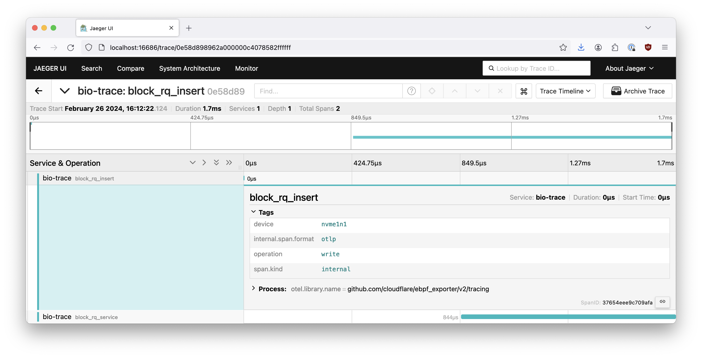
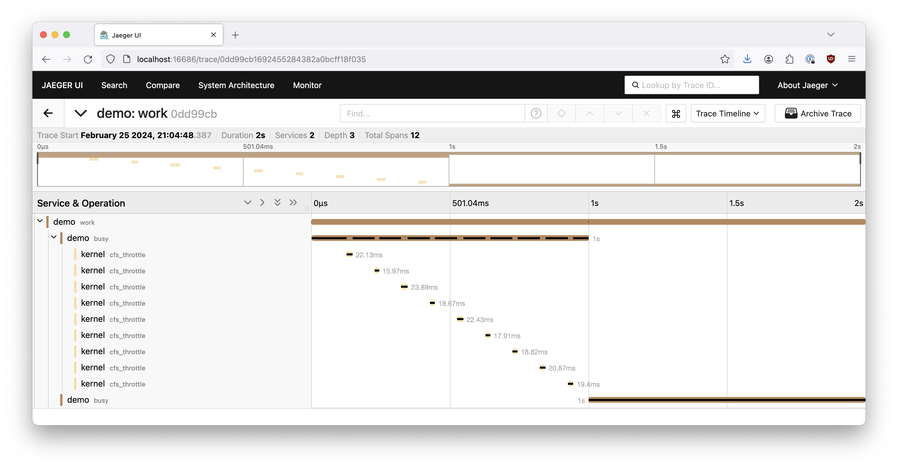
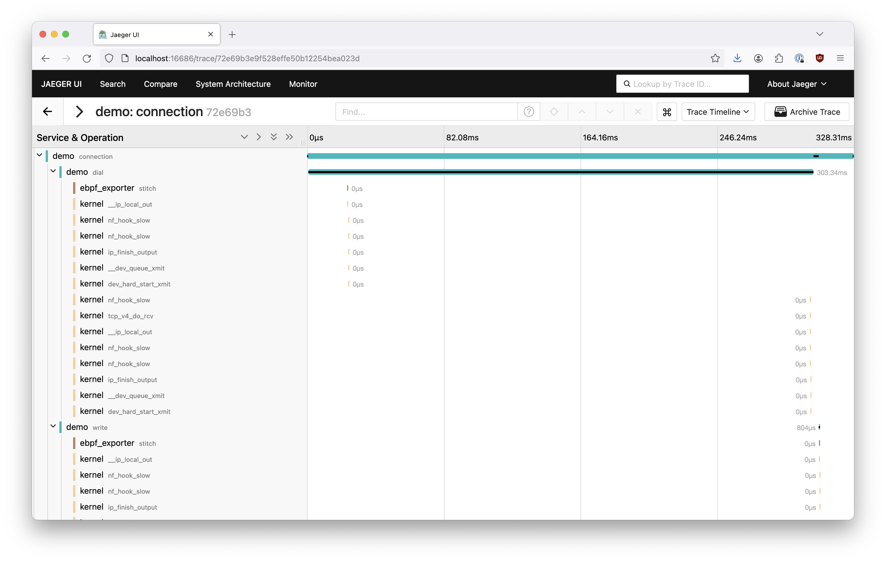

# Distributed Tracing with eBPF

Traces can be produced from ebpf_exporter. These can be isolated to the kernel
or joined with userspace components with enough scaffolding.

## Configuration

### Exporter configuration

Tracing is configured with the `autoexport` package provided by OpenTelemetry:

* https://pkg.go.dev/go.opentelemetry.io/contrib/exporters/autoexport

This means that you need to use env variables to configure where to send spans.

For local testing the simplest way to get started is to run Jaeger locally:

```
docker run --rm -it --net host jaegertracing/jaeger:2.12.0
```

The UI would be available at [http://localhost:16686/](http://localhost:16686/).

To configure ebpf_exporter to use Jaeger pass the following env variable:

```
OTEL_EXPORTER_OTLP_ENDPOINT=http://localhost:4318
```

On startup ebpf_exporter produces a trace for the loaded configs. If tracing
is configured properly, you should be able to see it.

### Program configuration

Rather than turning eBPF maps into metrics, for tracing we take messages
from ring buffers, transform them using the same label decoders, and turn
them into spans.

Rather than using the top level `metrics` key, `tracing` key is used:

```yaml
tracing:
  spans:
    - name: exec # name of the span (can be overridden with labels)
      ringbuf: exec_spans # ringbuf to read from
      service: exec-trace # service name (optional, defaults to ebpf_exporter)
      labels: # labels configuration (see main README.md)
        - ...
```

Here's how you configure a ringbuf in en eBPF program:

```c
struct {
    __uint(type, BPF_MAP_TYPE_RINGBUF);
    __uint(max_entries, 256 * 1024);
} exec_spans SEC(".maps");
```

To submit a span:

```c
struct exec_span_t *span;

span = bpf_ringbuf_reserve(&exec_spans, sizeof(struct exec_span_t), 0);
if (!submit) {
    return 0;
}

// fill out span here before submitting

bpf_ringbuf_submit(span, 0);
```

There are helpers in [`tracing.bpf.h`](../examples/tracing.bpf.h).

Some basic labels are expected to be configured to properly function:

```yaml
- name: trace_id
    size: 16
    decoders:
    - name: hex
- name: parent_span_id
    size: 8
    decoders:
    - name: hex
- name: span_id
    size: 8
    decoders:
    - name: hex
- name: span_monotonic_timestamp_ns
    size: 8
    decoders:
    - name: uint
- name: span_duration_ns
    size: 8
    decoders:
    - name: uint
```

These are also a part of `struct span_base_t` from `tracing.bpf.h`.

## Examples

There are several included examples that showcase tracing capabilities.

To build the demos for examples below, run:

```
make tracing-demos
```

### `bio-trace`

* Config: [bio-trace.yaml](../examples/bio-trace.yaml)
* eBPF: [bio-trace.bpf.c](../examples/bio-trace.bpf.c)
* Userspace: n/a

In this example we trace block io insertion and servicing. Here's a random
write request caught by tracing with this example:



### `cfs-throttling-trace`

* Config: [cfs-throttling-trace.yaml](../examples/cfs-throttling-trace.yaml)
* eBPF: [cfs-throttling-trace.bpf.c](../examples/cfs-throttling-trace.bpf.c)
* Userspace: [cfs-throttling](./demos/cfs-throttling/)

In this example we do some compute-intensive work. We also set up tracing
to add kernel spans if the scheduler decides to throttle us.

It makes sense to run this demo with CFS throttling enabled:

```
sudo systemd-run --pty --quiet --collect --unit demo.service --property CPUQuota=80% --property Environment=GOMAXPROCS=1 ./tracing/demos/cfs-throttling/demo
```

This results in a trace that looks like this:



We enabled kernel tracing for the first span and disabled for the second one.

Notice that both userspace and kernel spans are present in the same trace.

### `exec-trace`

* Config: [exec-trace.yaml](../examples/exec-trace.yaml)
* eBPF: [exec-trace.bpf.c](../examples/exec-trace.bpf.c)
* Userspace: n/a

In this example we generate traces for executions of binaries that originate
in `/bin/bash`. Every binary's lifetime is a span and spans are named after
binaries, so that end user traces end up looking like this:


The trace above shows an ssh session where `sudo apt-get update` ran.

### `sched-trace`

* Config: [sched-trace.yaml](../examples/sched-trace.yaml)
* eBPF: [sched-trace.bpf.c](../examples/sched-trace.bpf.c)
* Userspace: [sched](./demos/sched/)

In this example we add zero-width spans for tracing events.

Run the demo to produce a trace:

```
GOMAXPROCS=1 ./tracing/demos/sched/demo
```

The trace would look something like this:


Similar to CFS throttling example, there's both userspace and kernel parts
present in the same trace, with one part traced and one not.

### `sock-trace`

* Config: [sock-trace.yaml](../examples/sock-trace.yaml)
* eBPF: [sock-trace.bpf.c](../examples/sock-trace.bpf.c)
* Userspace: [sock](./demos/sock/)

In this example we enable tracing for a specific socket during connection
start-up in a userspace component. We then attach kernel spans to the relevant
spans as a part of the connection's lifetime: `dial`, `write`, `read`, `close`.

To run the demo:

```
./tracing/demos/sock/demo
```



The demo showcases multiple attached kernel functions, but you can imagine
only being interested in a few of them (like TCP retransmits).
